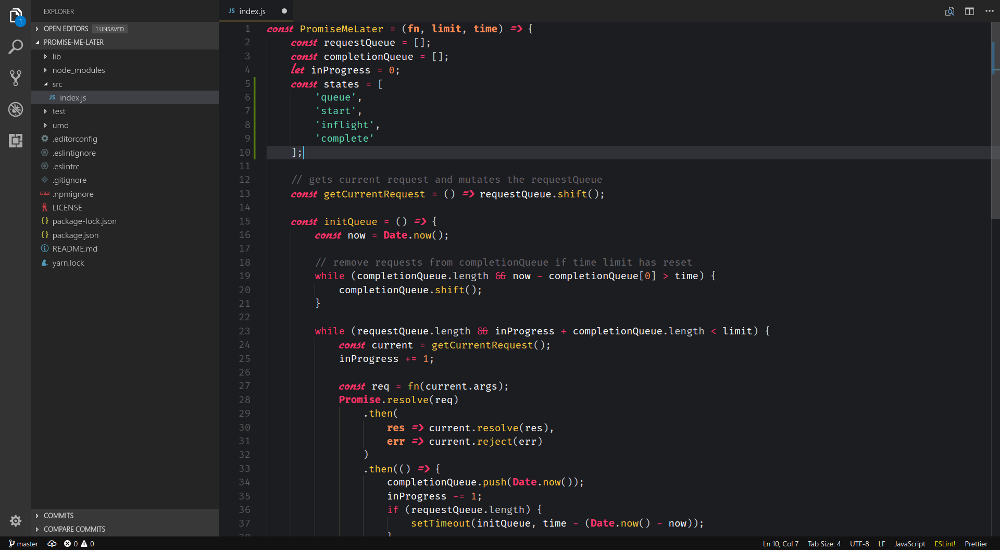
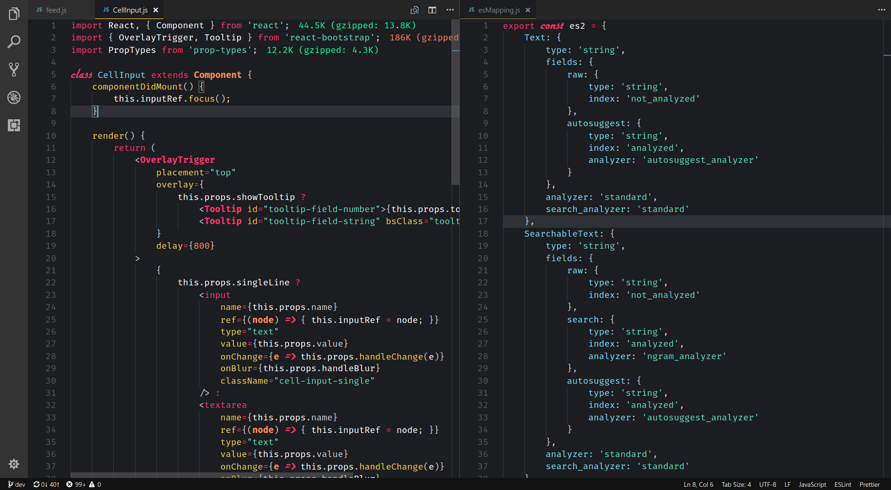

# Back to the Code

## VSCode theme inspired by Back to the Future from a fan driving at 88mph 🚗 ⚡️

An easy on eyes gorgeous theme so you can always get **Back to the Code**.

## Preview

## Bugs and Issues

Found an issue with the theme? Does it look weird with some particular code snippet? No worries, please report an [issue](https://github.com/divyanshu013/back-to-the-code/issues) with the snippet and a screenshot and I'll get back to it :grin:

## Bonus Content

- [Back to the Code Wallpaper 1](https://divyanshu013.deviantart.com/art/Back-to-the-code-wallpaper-dark-709931130)
- [Back to the Code Wallpaper 2](https://divyanshu013.deviantart.com/art/Back-to-the-code-wallpaper-709932529)
- [Color Palette Inspiration](https://i.imgur.com/z24sojs.jpg)

## License

MIT